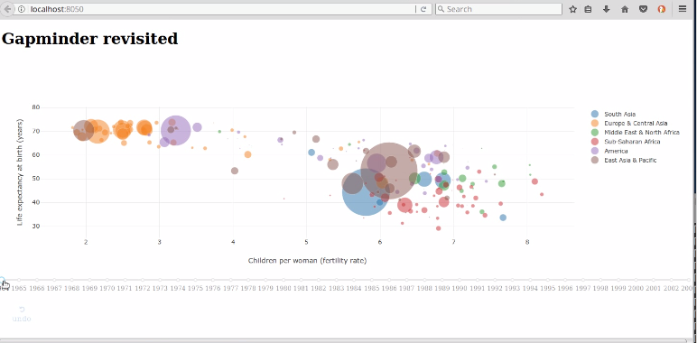

# pyptug_plotly

notebooks and related material from my PYPTUG talk:

### "Plotly, Dash and Company"

## Abstract

There are many visualization packages available out there, each best suited to specific scenarios. In the past 
several years, I've covered [Matplotlib](http://matplotlib.org), [Seaborn](http://seaborn.pydata.org), 
[Vincent](https://github.com/wrobstory/vincent), [ggplot2](http://ggplot2.org), 3d visualizations through matplotlib,
[D3.js](http://D3js.org), [mpld3](https://mpld3.github.io/) and [Bokeh](https://bokeh.pydata.org/en/latest/) and
mentioned a few more. 

In this presentation we will cover [plotly](http://plot.ly) (for javascript, R, Python and more) and related packages
(dash, cufflinks) and when it makes sense to use it.


## Bio

Francois Dion is the founder and Chief Data Scientist of Dion Research LLC, a firm specializing in analytics,
data science, IoT and visualization. 

He is the author of several open source software, such as [stemgraphic](www.stemgraphic.org), the founder of the
Python user group for the Piedmont Triad of North Carolina [PYPTUG](www.pyptug.org) and mentors various groups
in Python, R and analytics at large. You might have run across his multiple part series on LinkedIn on 
data science books including [part V](https://www.linkedin.com/pulse/ex-libris-data-scientist-part-v-visualization-francois-dion) on Visualization.

## Requirements

**notebooks** require jupyter notebook to be installed. They also require _matplotlib_, _numpy_, _pandas_, 
_plotly_ and _cufflinks_.

Web applications (**plotly_01, dash_01 to 04, gapminder**) will also need _Flask_, _pandas_datareader_, _dash_,
_dash-core-components_, _dash-html-components_ and _dash-renderer_.

To install all of these:
```bash
pip install -r requirements.txt
```


## Code

```
.
├── dash_01.py                          # Very simple Dash application
├── dash_02                             # Combining traditional Flask app with Dash app
│   ├── composite.py
│   ├── static
│   └── templates
│       └── main.html
├── dash_03.py                          # callbacks, inputs and output
├── dash_04.py                          # a way around to have raw html
├── data
│   ├── gapminder.csv                   # for the gapminder app
│   ├── midwest.csv                     # for the notebooks
│   └── school_earnings.csv             # for the notebooks
├── F_Dion_Gapminder_revisited.ogv      # Video. See Gapminder Revisited section below
├── gapminder.py                        # Hans Rosling's 2006 TEDx visualization
├── LICENSE
├── notebooks                           # Start here, with the notebooks
│   ├── 01-table_basic.ipynb            
│   ├── 02-cufflink.ipynb
│   ├── 03-more_cufflinks.ipynb
│   └── 04-mpl_box_and_box.ipynb
├── plotly_01                           # Plotly + Flask
│   ├── app.py
│   └── templates
│       └── main.html
└── README.md
```


## Gapminder Revisited

In 2006, Hans Rosling (who passed away in February of 2017 - listen to 
[datastori.es](http://datastori.es/92-a-tribute-to-hans-rosling/) for a whole podcast on his legacy),
gave a TEDx talk that fundamentally changed how people viewed visualization and the communication of statistics.

In [this talk](https://www.youtube.com/watch?v=hVimVzgtD6w) (first 5 minutes), he presented his gapminder software,
where he compared in a bubble chart, longevity vs fertility rate, for a large number of countries. The size of each bubble represents the population
of the country.

I gathered the data he used (see the data folder) and in the gapminder.py program, I filtered the years to be between
1964 and 2003, just as in the original TEDx talk. On the plotly site there is also a gapminder visualization, but
it is a different comparison, of GDP and life expectancy.

My gapminder version is a relatively simple dash application, with a year
slider at the bottom. In the original presentation, the sequence of years was on autoplay. Here in the below
video, I am dragging the slider from 1964 to 2003. Notice what happens in 1994. Due to autoscale, the visual
representation changes, which caused me to stop and hover the country that appeared to be out of place.

More on this after the video (click on the image below)

[](https://youtu.be/Fh7J6KA2NR8)

So what happened in 1994?

If you need a hint: Rwanda. Civil war and genocide. Suddenly, this visualization has a lot more meaning. All because
of the interactivity. A reminder that behind statistics, there are people.

## Links

A few links shared during the presentation:

 - [What's going on with this graph?](https://www.nytimes.com/2017/09/06/learning/announcing-a-new-monthly-feature-whats-going-on-in-this-graph.html)
 - [anaconda](http://anaconda.com)
 - [Flask](http://flask.pocoo.org/)
 - [Jupyter notebook]()
 - [pandas](http://pandas.pydata.org/)
 - [Classic visualization remakes](https://blog.plot.ly/post/120532468127/how-to-analyze-data-seven-modern-remakes-of-the)
 - [dash](http://plot/ly/dash)
 - [cufflinks](https://github.com/mwaskom/seaborn)
 - [plotly](http://plot.ly)
 - [Napoleon's March on Moscow, plotly style](https://plot.ly/~Dreamshot/393/napoleons-march-to-moscow-the-war-of-1812-map-representing-the-losses-over-time-/#plot)
